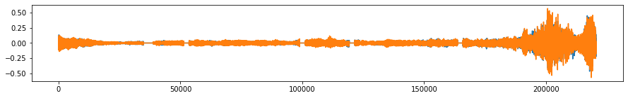
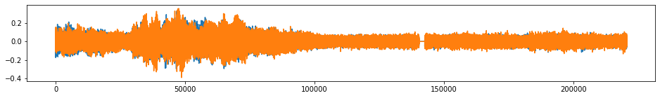
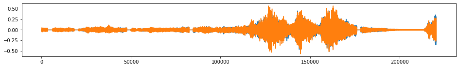

***********
Quick Start
***********

Augment a batch of multivariate time series
===========================================

1. Load time series.

.. code-block:: python

    >>> import numpy as np
    >>> X = np.load("./X.npy")
    >>> Y = np.load("./Y.npy")
    >>> from tsaug.visualization import plot
    >>> plot(X, Y)

2. Build a pipeline of augmenters as follows:

    - random time warping 5 times in parallel,
    - random crop subsequences with length 300,
    - random quantize to 10-, 20-, or 30- level sets,
    - with 80% probability , random drift the signal up to 10% - 50%,
    - with 50% probability, reverse the sequence.

.. code-block:: python

    >>> from tsaug import TimeWarp, Crop, Quantize, Drift, Reverse
    >>> my_augmenter = (
    ...     TimeWarp() * 5  # random time warping 5 times in parallel
    ...     + Crop(size=300)  # random crop subsequences with length 300
    ...     + Quantize(n_levels=[10, 20, 30])  # random quantize to 10-, 20-, or 30- level sets
    ...     + Drift(max_drift=(0.1, 0.5)) @ 0.8  # with 80% probability, random drift the signal up to 10% - 50%
    ...     + Reverse() @ 0.5  # with 50% probability, reverse the sequence
    ... )

3. Augment the batch.

.. code-block:: python

    >>> X_aug, Y_aug = my_augmenter.augment(X, Y)
    >>> plot(X_aug, Y_aug)

Augment a 2-channel audio sequence
===========================================

1. Load audio sequence.

.. code-block:: python

    >>> import librosa
    >>> from IPython.display import Audio
    >>> beethoven, samplerate = librosa.load("./beethoven.wav", mono=False)
    >>> beethoven = np.expand_dims(beethoven.swapaxes(0,1), 0) # reshape the numpy array to input of tsaug
    >>> plot(beethoven)
    >>> Audio(beethoven.reshape(-1, 2).T, rate=samplerate)

.. image:: _static/image/beethoven.png

.. raw:: html

    <audio controls  style="1900px;">
        <source src="_static/audio/beethoven.wav" type="audio/wav">
    </audio>

2. Build a pipeline of augmenters as follows:

    - random crop subsequences of 10 seconds,
    - with 50% probability, add random noise up to 1% - 5%,
    - drop out 10% of the time points (dropped out units are 2ms, 5 ms, or 10 ms) and fill the dropped out points with zeros.

.. code-block:: python

    >>> from tsaug import Crop, AddNoise, Dropout
    >>> my_augmenter = (
    ...     Crop(size=samplerate * 10) * 5  # random crop subsequences of 10 seconds
    ...     + AddNoise(scale=(0.01, 0.05)) @ 0.5  # with 50% probability, add random noise up to 1% - 5%
    ...     + Dropout(
    ...         p=0.1, fill=0, size=[0.002 * samplerate, 0.005 * samplerate, 0.01 * samplerate]
    ...     )  # drop out 10% of the time points (dropped out units are 2ms, 5 ms, or 10 ms) and fill the dropped out points with zeros
    ... )

3. Augment the audio sequence.

.. code-block:: python

    >>> beethoven_aug = my_augmenter.augment(beethoven)
    >>> for i in range(5):
    ...     plot(beethoven_aug[[i]])
    ...     Audio(beethoven_aug[i].reshape(-1, 2).T, rate=samplerate)

.. raw:: html

    <audio controls  style="1900px;">
        <source src="_static/audio/beethoven_augmented_0.wav" type="audio/wav">
    </audio>

.. raw:: html

    <audio controls  style="1900px;">
        <source src="_static/audio/beethoven_augmented_1.wav" type="audio/wav">
    </audio>

.. raw:: html

    <audio controls  style="1900px;">
        <source src="_static/audio/beethoven_augmented_2.wav" type="audio/wav">
    </audio>

.. raw:: html

    <audio controls  style="1900px;">
        <source src="_static/audio/beethoven_augmented_3.wav" type="audio/wav">
    </audio>

.. raw:: html

    <audio controls  style="1900px;">
        <source src="_static/audio/beethoven_augmented_4.wav" type="audio/wav">
    </audio>
